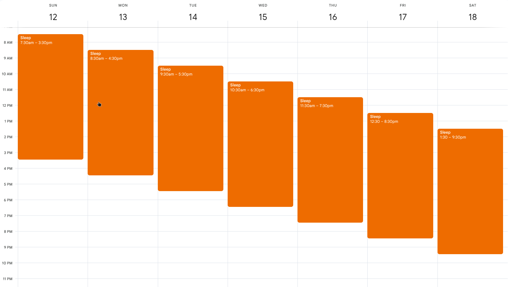

# long-day-simulator
What if days were 25h instead of 24? You'd get an extra hour each day, just by shifting your bedtime an hour later each "night".

This script generates calendar events which mark the awake and asleep times in a calendar.

The exported calendar is in ICS format, and can be imported to Google Calendar (and others) easily.

## Example



## Overall Stats

* Instead of sleeping 8h out of 24h (33.3% of the time, 240 hours per month), you're instead sleeping 8h out of 25h (32% of the time, 230.4 hours per month).

## How to Use

### Installation

First, install Rust/`cargo` by following the instructions at: https://rustup.rs.

Next, install this tool:

```sh
cargo install long_day_simulator
```

### Basic Usage

Running with no arguments simulates a 25-hour day starting at 1:30 AM today, for 30 days, and writes sleep periods to `long_day_schedule.ics` in the current directory:

```sh
long_day_simulator
```

Import the resulting `.ics` file into any calendar app (Google Calendar, Apple Calendar, Outlook, etc.).

**Note:** When importing into Google Calendar, it is strongly recommended you create a NEW calendar so you can easily delete everything after testing.

### Options

| Flag | Description | Default |
|---|---|---|
| `--bedtime <HH:MM>` | Bedtime on the start day (24h) | `01:30` |
| `--start-date <YYYY-MM-DD>` | First day of the simulation | today |
| `--sleep-hours <FLOAT>` | Hours of sleep per cycle | `8` |
| `--day-length-hours <FLOAT>` | Total day length in hours | `25` |
| `--days <INT>` | Number of days to simulate | `30` |
| `-o, --output <PATH>` | Output `.ics` file path | `long_day_schedule.ics` |
| `--include <LIST>` | Event periods to generate: `sleep`, `awake`, or both comma-separated | `sleep` |

### Examples

Simulate a 28-hour day for 60 days, saving to a custom file:
```sh
long_day_simulator --day-length-hours 28 --days 60 --output my_schedule.ics
```

Include both sleep and awake blocks in the calendar:
```sh
long_day_simulator --include sleep,awake
```

Start from a specific date with a custom bedtime and sleep duration:
```sh
long_day_simulator --start-date 2026-05-01 --bedtime 23:00 --sleep-hours 7.5
```
